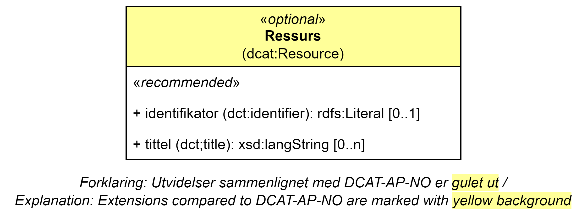

== Klassen Ressurs (dcat:Resource) [[Ressurs]]

[[img-klassenRessurs]]
.Klassen Ressurs (cdvno:Block). 
[link=images/cdvno-resource.png]

<> viser klassen Ressurs (`dcat:Resource`). 

[cols="30s,70d"]
|===
| _English name_ | _Resource_
| Anvendelse / _Usage note_ | Klassen brukes til å representere en ressurs som f.eks. er kilde til innholdet i en blokk. 

_The class is used to represent a resource which is e.g. the source of origin to the content in a block._
| URI | dcat:Resource
| Kravnivå / _Requirement level_ | Valgfri / _Optional_
| Merknad / _Note_ | I tillegg til egenskapene spesifisert her, kan egenskapene til https://www.w3.org/TR/vocab-dcat-2/#Class:Resource[klassen Katalogisert ressurs (dcat:Resource) spesifisert i DCAT &#x29C9;, window="_blank", role="ext-link"] også brukes. 

__In addition to the properties that are specified here, the properties in https://www.w3.org/TR/vocab-dcat-2/#Class:Resource[the Class Cataloged Resource (dcat:Resource) specified in DCAT &#x29C9;, window="_blank", role="ext-link"] may also be used.__
|===

=== Anbefalte egenskaper for _Ressurs_ [[Ressurs-anbefalte-egenskaper]]

==== Ressurs - identifikator (dct:identifier) [[Ressurs-identifikator]]  

[cols="30s,70d"]
|===
| _English name_ | _identifier_
| URI | dct:identifier
| Verdiområde / _Range_ | xsd:anyURI
| Anvendelse / _Usage note_ | Egenskapen brukes til å oppgi identifikatoren til ressursen.

_This property is used to specify the identifier to the resource._
| Multiplisitet / _Multiplicity_ | 0..1
| Kravnivå / _Requirement level_ | Anbefalt / _Recommended_
|===

==== Ressurs - tittel (dct:title) [[Ressurs-tittel]]  

[cols="30s,70d"]
|===
| _English name_ | _title_
| URI | dct:title
| Verdiområde / _Range_ | rdf:langString
| Anvendelse / _Usage note_ | Egenskapen brukes til å oppgi tittelen til ressursen. Egenskapen bør gjentas når tittelen finnes på flere språk. 

_This property is used to specify the title of the resource. This property should be repeated for parallel language versions of the title._
| Multiplisitet / _Multiplicity_ |  0..n
| Kravnivå / _Requirement level_ | Anbefalt / _Recommended_
|===

